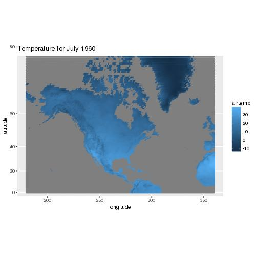
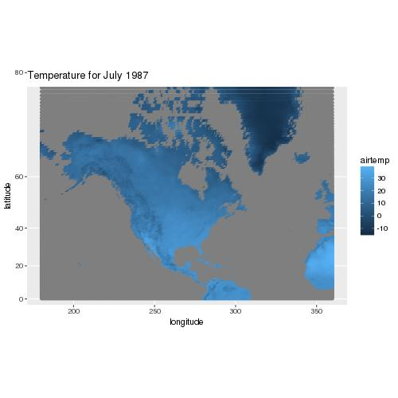
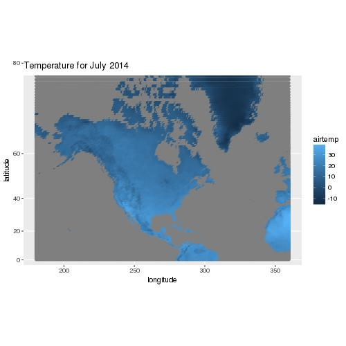
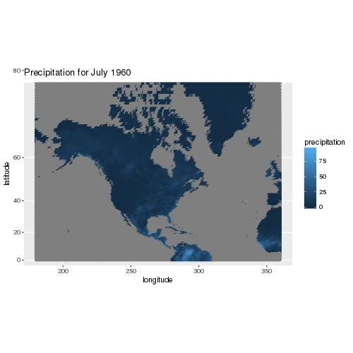

# Climate Report

## North American Temperature and Precipitation, 1960-2014

### Temperature

The temperature patterns look fairly reasonable, but actually I do not see any major differences on each year's temperature, showing that the temperature is relatively steady in North America from 1960 to 2014.

### Precipitation

The precipitation also looks reasonable as there are a few minor differences on each year's precipitation amount, as the color of the graph gradually becomes lighter, it shows that North America's precipiation amount keeps increasing from 1960 to 2014.  
